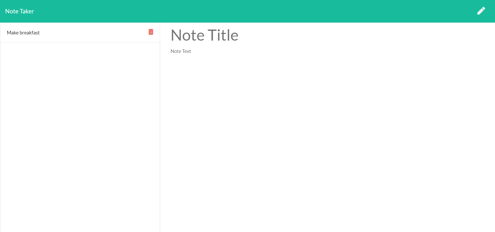

# notetaker

## Screenshot:

## USAGE:
GIVEN a note-taking application
WHEN user open the Note Taker then user is presented with a landing page with a link to a notes page

WHEN user clicks on the link to the notes page then is presented with a page with existing notes listed in the left-hand column, plus empty fields to enter a new note title and the note’s text in the right-hand column

WHEN user enters a new note title and the note’s text then a Save icon appears in the navigation at the top of the page

WHEN user clicks on the Save icon then the new note user entered is saved and appears in the left-hand column with the other existing notes

WHEN user clicks on an existing note in the list in the left-hand column then that note appears in the right-hand column

WHEN user clicks on delete icon on an existing note in the list in the left-hand column then the note is deleted from the app in the right-hand column

WHEN the user clicks on the Write icon in the navigation at the top of the page then is presented with empty fields to enter a new note title and the note’s text in the right-hand column

## Link to the site:
https://ryan-notetaker.herokuapp.com/